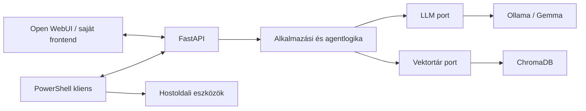

# Kelvin Assistant

A Kelvin Assistant egy moduláris, elsődlegesen offline működésre tervezett,
helyi AI-asszisztens. Az alkalmazás-infrastruktúra Ubuntu Server 24.04 LTS
Hyper-V virtuális gépen fut, míg a későbbi PowerShell-kliens a Windows 11
hoston biztosít Codexhez hasonló terminálos munkafolyamatot.

## Jelenlegi állapot

A projekt **v0.2 Runtime** mérföldköve elkészült; a következő fejlesztési
szakasz a v0.3 Conversation. A FastAPI backend Windowson fejlesztői
folyamatként, a saját Ubuntu Server VM-en pedig automatikusan induló
`systemd` szolgáltatásként fut. Az ellenőrzések helyileg, a VM-en és GitHub
Actions alatt Ubuntu 24.04 / Python 3.12 környezetben is sikeresek.

Jelenleg működik:

- `uv`-alapú, zárolt Python-környezet;
- FastAPI és Uvicorn;
- Pydantic Settings konfiguráció;
- strukturált JSON- és fejlesztői konzolnaplózás;
- `/`, `/health`, `/ready` és `/version` végpont;
- pytest, Ruff és mypy ellenőrzés;
- GitHub Actions CI;
- Hyper-V Generation 2 Ubuntu Server VM;
- SSH-kulcsos adminisztráció és UFW tűzfal;
- újraindítás után automatikusan felálló FastAPI szolgáltatás;
- cserélhető LLM-port és Ollama adapter;
- konfigurálható modell, runtime URL és timeout;
- egységes Ollama hibák és modell-readiness ellenőrzés;
- hálózatfüggetlen unit tesztek és opcionális élő Ollama-próba;
- Ubuntu VM-ből elért Windows Ollama és 100% GPU-n futó Gemma 4 E4B.

A chat API, streaming, RAG, memória és agentfunkciók még nincsenek
integrálva. A DHCP-foglalás, az offline csomag-előkészítés és a mentési
eljárás még hátralévő üzemeltetési feladat.

## Projektcél

A rendszer fokozatosan az alábbi képességeket biztosítja:

- helyi nyelvi modellek futtatása Ollamával;
- cserélhető modellek, elsőként Google Gemma;
- dokumentumfeldolgozás és RAG;
- rövid és hosszú távú memória;
- verziózott FastAPI API;
- Open WebUI, később opcionális saját webes felület;
- PowerShell-alapú agentkliens;
- később Whisper beszédfelismerés és Piper TTS;
- később szabályozott automatizálási lehetőségek.

A cél a teljesen offline futás. A telepítőcsomagokat, Python-függőségeket és
modellfájlokat az offline üzembe helyezés előtt ellenőrzött módon kell
beszerezni és a virtuális gépre átvinni.

## Célarchitektúra



A diagram a tervezett célállapotot mutatja. A backend később portokon
keresztül éri el a modelleket, embedding-szolgáltatókat, vektortárakat és
dokumentumbetöltőket. Az Ollama és a ChromaDB ezek adapterei lesznek, ezért
más implementációra cserélhetők.

A Windows hoston végzett PowerShell-, Git- és fájlműveleteket a hostoldali
kliens hajtja végre. A Linux VM nem kap korlátlan távoli hozzáférést a
Windowshoz. Minden veszélyes művelethez külön jóváhagyási és naplózási
szabály tartozik majd.

Részletesen: [docs/architecture.md](docs/architecture.md).

## Telepítés

Fejlesztői indítás Windowson:

```powershell
git clone https://github.com/ZoltanKarika/Kelvin-Assistant.git
Set-Location "Kelvin-Assistant"
Copy-Item .env.example .env
uv sync --locked --all-groups
uv run kelvin-api
```

A szerver alapértelmezetten a `http://127.0.0.1:8000` címen indul. Leállítása
`Ctrl+C` billentyűkombinációval történik.

Részletesen: [docs/installation.md](docs/installation.md).

Az Ubuntu VM-en a backend `systemd` szolgáltatásként fut. Állapota:

```bash
systemctl status kelvin-api
```

## Használat

Az API ellenőrzése PowerShellből:

```powershell
Invoke-RestMethod http://127.0.0.1:8000/
Invoke-RestMethod http://127.0.0.1:8000/health
Invoke-RestMethod http://127.0.0.1:8000/ready
Invoke-RestMethod http://127.0.0.1:8000/version
```

Opcionális élő Ollama-ellenőrzés:

```powershell
uv run python scripts/check_ollama.py
```

Interaktív API-dokumentáció:

- Swagger UI: `http://127.0.0.1:8000/docs`
- ReDoc: `http://127.0.0.1:8000/redoc`

Fejlesztői ellenőrzések:

```powershell
uv run ruff check backend tests scripts
uv run ruff format --check backend tests scripts
uv run mypy backend/src tests scripts
uv run pytest --cov=kelvin_assistant --cov-report=term-missing
```

## Roadmap

| Verzió | Cél | Állapot |
| --- | --- | --- |
| v0.1 Foundation | Repository, CI, dokumentáció, Hyper-V, Ubuntu | Kész |
| v0.2 Runtime | FastAPI, Ollama és Gemma | Kész |
| v0.3 Conversation | Chat API, streaming és sessionkezelés | Tervezett |
| v0.4 Knowledge | RAG és ChromaDB | Tervezett |
| v0.5 Memory | Rövid és hosszú távú memória | Tervezett |
| v0.6 Agent | Eszközhívások, PowerShell és Git | Tervezett |
| v0.7 Voice | Whisper és Piper | Tervezett |
| v1.0 Stable | Stabil, dokumentált offline AI-platform | Tervezett |

Részletesen: [docs/roadmap.md](docs/roadmap.md).

## Fejlesztési elvek

- egy logikai változtatás feature vagy karbantartási ágon;
- kis, ellenőrizhető commitok;
- Conventional Commits;
- minden új viselkedéshez automatikus teszt;
- type hint, docstring, naplózás és kezelt kivételek;
- titkok és futásidejű adatok nem kerülnek a repositoryba;
- fontos architekturális döntések ADR-ben kerülnek rögzítésre.

Példa commitüzenetek:

```text
feat: add ollama language model provider
fix: handle model request timeout
docs: document offline model provisioning
refactor: separate retrieval from prompt assembly
test: cover document chunking edge cases
chore: configure python quality tools
```

## Licenc

A Kelvin Assistant saját forráskódja és dokumentációja az Apache License 2.0
feltételei alatt használható. A külső függőségek, modellek és önálló
komponensek saját licencei és felhasználási feltételei továbbra is érvényesek.

Részletek:

- [LICENSE](LICENSE)
- [NOTICE](NOTICE)
- [THIRD_PARTY_NOTICES.md](THIRD_PARTY_NOTICES.md)
- [docs/licensing.md](docs/licensing.md)
