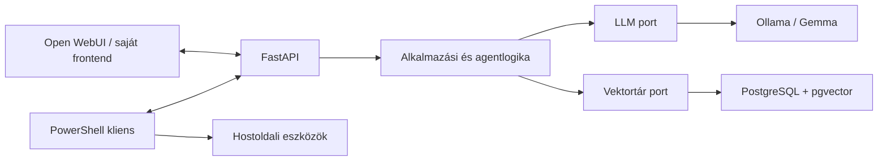

# Kelvin Assistant

A Kelvin Assistant egy moduláris, elsődlegesen offline működésre tervezett,
helyi AI-asszisztens. Az alkalmazás-infrastruktúra Ubuntu Server 24.04 LTS
Hyper-V virtuális gépen fut, míg a későbbi PowerShell-kliens a Windows 11
hoston biztosít Codexhez hasonló terminálos munkafolyamatot.

## Jelenlegi állapot

A projekt a **v1.0 Stable** előkészítésénél tart. A FastAPI backend Windowson
fejlesztői folyamatként, a saját Ubuntu Server VM-en pedig automatikusan induló
`systemd` szolgáltatásként fut. A v1.0 telepítési, üzemeltetési, mentési,
biztonsági, API-szerződéses és offline kiadási dokumentáció elkészült; a teljes
end-to-end stabil kiadás ellenőrzése a következő lépés.

Jelenleg működik:

- `uv`-alapú, zárolt Python-környezet;
- FastAPI és Uvicorn;
- Pydantic Settings konfiguráció;
- strukturált JSON- és fejlesztői konzolnaplózás;
- `/`, `/health`, `/ready` és `/version` végpont;
- `/ready/database` PostgreSQL readiness végpont;
- pytest, Ruff és mypy ellenőrzés;
- GitHub Actions CI;
- Hyper-V Generation 2 Ubuntu Server VM;
- SSH-kulcsos adminisztráció és UFW tűzfal;
- újraindítás után automatikusan felálló FastAPI szolgáltatás;
- cserélhető LLM-port és Ollama adapter;
- konfigurálható modell, runtime URL és timeout;
- egységes Ollama hibák és modell-readiness ellenőrzés;
- hálózatfüggetlen unit tesztek és opcionális élő Ollama-próba;
- Ubuntu VM-ből elért Windows Ollama és 100% GPU-n futó Gemma 4 E4B;
- verziózott `POST /api/v1/chat` végpont;
- `POST /api/v1/chat/stream` SSE streaming végpont;
- minimális, framework nélküli webes chatfelület a `/ui` útvonalon;
- UUID-alapú, többfordulós memóriabeli sessionkezelés;
- külön chat alkalmazási service és cserélhető sessiontár;
- konfigurálható asszisztens rendszerprompt;
- PostgreSQL + pgvector alapú RAG tudástár;
- Markdown/text dokumentumimport és szemantikus keresés;
- RAG context bekötése a chat válaszok elé;
- PostgreSQL alapú hosszú távú memória;
- `POST /api/v1/memory`, `GET /api/v1/memory` és
  `DELETE /api/v1/memory/{memory_id}`;
- aktív user memóriák chat contextbe illesztése;
- nyelvsemleges chat context promptok.
- természetes nyelvű, többfordulós agent planner;
- policy-ellenőrzött Git-, keresési és fájleszközök;
- Windows `kelvin` kliens helyi végrehajtással;
- diff-előnézet és jóváhagyás fájlmódosítás előtt;
- PostgreSQL agent audit és szabályos `Ctrl+C` cancellation;
- **AI Security Gateway (Firewall for AI)**: input guard prompt injection ellen, context guard a memóriahatárok megtartására, és output guard a titkok maszkolására;
- **IP allowlist és hálózati korlátozások**: webhookok és endpointok CIDR-alapú ügyfélszűréssel és in-memory idempotencia védelemmel;
- **Munkamenet kontextus szűrés (Pruning)**: a workspace read/write eszközök (ripgrep, git status, patch) szűrése `.gitignore` és beépített minták alapján;
- **Konténerizációs tesztkörnyezet**: `Dockerfile.backend` és `docker-compose.test.yaml` a különálló tesztüzemhez;
- **Biztonságos credential-kezelés**: dokumentált n8n credential store használat külső LLM és képgenerálók számára.

A v1.0 előkészítő lépései elkészültek a Windows–Ubuntu production
környezethez. Az n8n-integráció, mentési eljárás, jogosultsági modell,
operátori UI és offline csomag-előkészítés dokumentált. Az opcionális
hangvezérlés és a nyilvános internetes kitettség nem része a v1.0 támogatott
felületének.

## Projektcél

A rendszer fokozatosan az alábbi képességeket biztosítja:

- helyi nyelvi modellek futtatása Ollamával;
- cserélhető modellek, elsőként Google Gemma;
- dokumentumfeldolgozás és RAG;
- rövid és hosszú távú memória;
- verziózott FastAPI API;
- saját webes felület, később opcionálisan Open WebUI;
- PowerShell-alapú agentkliens;
- később Whisper beszédfelismerés és Piper TTS;
- később self-hosted n8n-en keresztül szabályozott automatizálás.

A cél a teljesen offline futás. A telepítőcsomagokat, Python-függőségeket és
modellfájlokat az offline üzembe helyezés előtt ellenőrzött módon kell
beszerezni és a virtuális gépre átvinni.

## Célarchitektúra



A diagram a tervezett célállapotot mutatja. A backend később portokon
keresztül éri el a modelleket, embedding-szolgáltatókat, vektortárakat és
dokumentumbetöltőket. Az Ollama és a PostgreSQL + pgvector ezek adapterei
lesznek, ezért más implementációra cserélhetők.

A Windows hoston végzett PowerShell-, Git- és fájlműveleteket a hostoldali
kliens hajtja végre. A Linux VM nem kap korlátlan távoli hozzáférést a
Windowshoz. Minden veszélyes művelethez külön jóváhagyási és naplózási
szabály tartozik majd.

Részletesen: [docs/architecture.md](docs/architecture.md).

## Telepítés

Fejlesztői indítás Windowson:

```powershell
git clone https://github.com/ZoltanKarika/Kelvin-Assistant.git
Set-Location "Kelvin-Assistant"
Copy-Item .env.example .env
uv sync --locked --all-groups
uv run kelvin-api
```

A szerver alapértelmezetten a `http://127.0.0.1:8000` címen indul. Leállítása
`Ctrl+C` billentyűkombinációval történik.

Részletesen: [docs/installation.md](docs/installation.md).

Az Ubuntu VM-en a backend `systemd` szolgáltatásként fut. Állapota:

```bash
systemctl status kelvin-api
```

## Használat

Az API ellenőrzése PowerShellből:

```powershell
Invoke-RestMethod http://127.0.0.1:8000/
Invoke-RestMethod http://127.0.0.1:8000/health
Invoke-RestMethod http://127.0.0.1:8000/ready
Invoke-RestMethod http://127.0.0.1:8000/ready/database
Invoke-RestMethod http://127.0.0.1:8000/version
```

Új chat session indítása PowerShellből:

```powershell
$body = @{ message = "Szia!" } | ConvertTo-Json
$chat = Invoke-RestMethod `
    -Method Post `
    -Uri http://127.0.0.1:8000/api/v1/chat `
    -ContentType "application/json; charset=utf-8" `
    -Body ([Text.Encoding]::UTF8.GetBytes($body))
$chat
```

A válasz `session_id` mezőjével a következő kérés ugyanabban a
beszélgetésben folytatható. Részletes példa:
[docs/installation.md](docs/installation.md).

Webes chatfelület:

- fejlesztői gépen: `http://127.0.0.1:8000/ui`
- Ubuntu VM-en: `http://<VM_IP>:8000/ui`

Streaming chat ellenőrzése PowerShellből:

```powershell
$body = @{
    message = "Please count from 1 to 5, one number per line."
} | ConvertTo-Json

curl.exe -N -X POST "http://127.0.0.1:8000/api/v1/chat/stream" `
    -H "Content-Type: application/json" `
    --data-binary $body
```

Természetes nyelvű agentfeladat indítása a Windows workspace-ben:

```powershell
.\.venv\Scripts\kelvin.exe `
  --api-url http://192.168.10.13:8000 `
  --workspace-id kelvin-assistant `
  agent "Show the current Git status and summarize the result."
```

A modell csak strukturált eszközt javasol. A tényleges Git- vagy
fájlműveletet a Windows kliens hajtja végre a megadott workspace-ben.
Állapotváltoztató művelet előtt diff-előnézet és helyi jóváhagyás szükséges.
A kliens `Ctrl+C` esetén a backend agentfutását is megszakítja.

Opcionális élő Ollama-ellenőrzés:

```powershell
uv run python scripts/check_ollama.py
```

Interaktív API-dokumentáció:

- Swagger UI: `http://127.0.0.1:8000/docs`
- ReDoc: `http://127.0.0.1:8000/redoc`

Fejlesztői ellenőrzések:

```powershell
uv run ruff check backend tests scripts
uv run ruff format --check backend tests scripts
uv run mypy backend/src tests scripts
uv run pytest --cov=kelvin_assistant --cov-report=term-missing
```

## Roadmap

| Verzió | Cél | Állapot |
| --- | --- | --- |
| v0.1 Foundation | Repository, CI, dokumentáció, Hyper-V, Ubuntu | Kész |
| v0.2 Runtime | FastAPI, Ollama és Gemma | Kész |
| v0.3 Conversation | Chat API, streaming és sessionkezelés | Kész |
| v0.4 Knowledge | RAG és PostgreSQL + pgvector | Kész |
| v0.5 Memory | Rövid és hosszú távú memória | Kész |
| v0.6 Agent | Eszközhívások, PowerShell és Git | Kész |
| v0.7 Safe n8n Foundation | Külön automation VM és biztonságos Kelvin API-integráció | Kész |
| v0.8 AI Security & Integration Hardening | AI Firewall, audit és bővített online AI-integrációk | Kész |
| v0.9 UI & Email Notifications | Helyi kezelőfelület és email értesítések | Kész |
| v1.0 Stable | Stabil, dokumentált offline AI-platform | Előkészítés alatt |

Részletesen: [docs/roadmap.md](docs/roadmap.md).

v1.0 tervezés: [docs/ai/v10-guide.md](docs/ai/v10-guide.md).

A memória részletes dokumentációja:
[v0.5 Memory](docs/memory-design.md).

PostgreSQL/pgvector infrastruktúra:
[docs/postgresql-pgvector.md](docs/postgresql-pgvector.md).

## Fejlesztési elvek

- egy logikai változtatás feature vagy karbantartási ágon;
- kis, ellenőrizhető commitok;
- Conventional Commits;
- minden új viselkedéshez automatikus teszt;
- type hint, docstring, naplózás és kezelt kivételek;
- titkok és futásidejű adatok nem kerülnek a repositoryba;
- fontos architekturális döntések ADR-ben kerülnek rögzítésre.

Példa commitüzenetek:

```text
feat: add ollama language model provider
fix: handle model request timeout
docs: document offline model provisioning
refactor: separate retrieval from prompt assembly
test: cover document chunking edge cases
chore: configure python quality tools
```

## Licenc

A Kelvin Assistant saját forráskódja és dokumentációja az Apache License 2.0
feltételei alatt használható. A külső függőségek, modellek és önálló
komponensek saját licencei és felhasználási feltételei továbbra is érvényesek.

Részletek:

- [LICENSE](LICENSE)
- [NOTICE](NOTICE)
- [THIRD_PARTY_NOTICES.md](THIRD_PARTY_NOTICES.md)
- [docs/licensing.md](docs/licensing.md)
