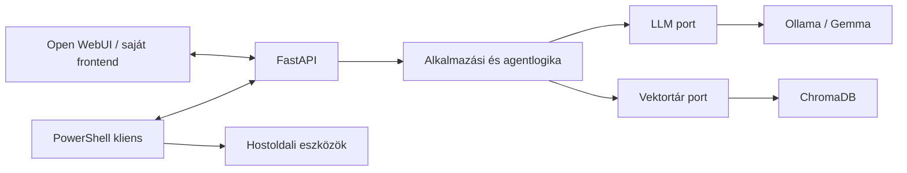

# Kelvin Assistant

A Kelvin Assistant egy moduláris, elsődlegesen offline működésre tervezett,
helyi AI-asszisztens. Az AI-infrastruktúra egy Ubuntu Server 24.04 LTS
Hyper-V virtuális gépen fut, míg a későbbi PowerShell-kliens a Windows 11
hoston biztosít Codexhez hasonló terminálos munkafolyamatot.

## Projektcél

A rendszer fokozatosan az alábbi képességeket biztosítja:

- helyi nyelvi modellek futtatása Ollamával;
- cserélhető modellek, elsőként Google Gemma;
- dokumentumfeldolgozás és RAG;
- rövid és hosszú távú memória;
- verziózott FastAPI API;
- Open WebUI, később opcionális saját webes felület;
- PowerShell-alapú agentkliens;
- később Whisper beszédfelismerés és Piper TTS;
- később szabályozott automatizálási lehetőségek.

A cél a teljesen offline futás. A telepítőcsomagokat, Python-függőségeket és
modellfájlokat az offline üzembe helyezés előtt ellenőrzött módon kell
beszerezni és a virtuális gépre átvinni.

## Architektúra



A backend portokon keresztül éri el a modelleket, embedding-szolgáltatókat,
vektortárakat és dokumentumbetöltőket. Az Ollama és a ChromaDB ezek
adapterei lesznek, ezért később más implementációra cserélhetők.

A Windows hoston végzett PowerShell-, Git- és fájlműveleteket a hostoldali
kliens hajtja végre. A Linux VM nem kap korlátlan távoli hozzáférést a
Windowshoz. Minden veszélyes művelethez külön jóváhagyási és naplózási
szabály tartozik majd.

Részletesen: [docs/architecture.md](docs/architecture.md).

## Telepítés

A projekt jelenleg az inicializálási szakaszban van, ezért még nem tartalmaz
futtatható szolgáltatást. A célkörnyezet és a későbbi telepítési folyamat:

1. Ubuntu Server VM előkészítése;
2. offline csomag- és modellcsomag összeállítása;
3. Python virtuális környezet létrehozása;
4. Ollama, a backend és az adattárolás konfigurálása;
5. szolgáltatások regisztrálása és állapotellenőrzése;
6. Windows PowerShell-kliens telepítése.

Részletesen: [docs/installation.md](docs/installation.md).

## Használat

Futtatható alkalmazás még nincs. A tervezett használati módok:

- HTTP API helyi alkalmazások számára;
- Open WebUI böngészős felület;
- `kelvin` parancs a Windows PowerShellben;
- dokumentumok betöltése és forrásalapú kérdezés.

A használati parancsokat csak a hozzájuk tartozó funkció implementálása és
tesztelése után rögzítjük.

## Roadmap

1. projektalapok és fejlesztési szabályok;
2. Ubuntu VM és offline telepítési folyamat;
3. Python backend és health API;
4. Ollama- és modellintegráció;
5. chat API és streaming;
6. dokumentumfeldolgozás és RAG;
7. hosszú távú memória;
8. Open WebUI-integráció;
9. PowerShell agentkliens és engedélyezett eszközhasználat;
10. beszéd és automatizálás.

Részletesen: [docs/roadmap.md](docs/roadmap.md).

## Fejlesztési elvek

- egy logikai változtatás feature vagy karbantartási ágon;
- kis, ellenőrizhető commitok;
- Conventional Commits;
- minden új viselkedéshez automatikus teszt;
- type hint, docstring, naplózás és kezelt kivételek;
- titkok és futásidejű adatok nem kerülnek a repositoryba;
- fontos architekturális döntések ADR-ben kerülnek rögzítésre.

Példa commitüzenetek:

```text
feat: add ollama language model provider
fix: handle model request timeout
docs: document offline model provisioning
refactor: separate retrieval from prompt assembly
test: cover document chunking edge cases
chore: configure python quality tools
```
